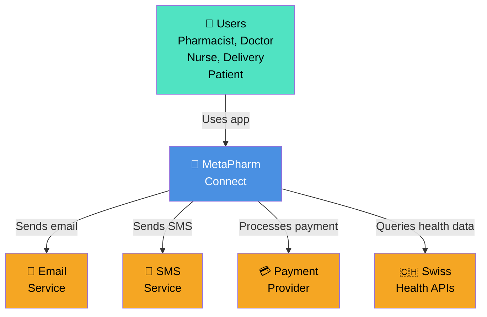
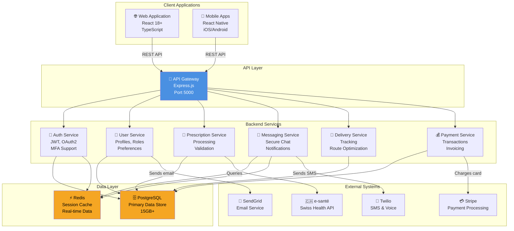
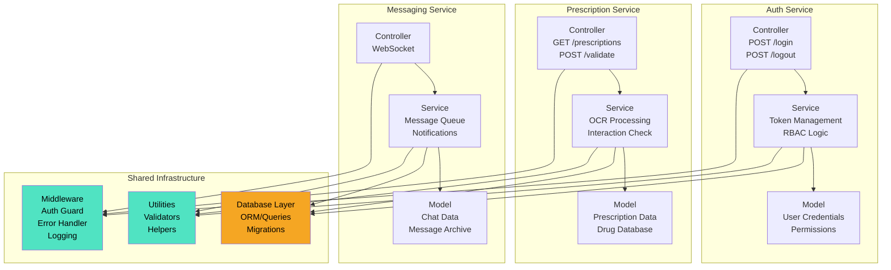

# Architecture Documentation

MetaPharm Connect system architecture, design patterns, and technical decisions.

## Table of Contents

1. [System Overview](#system-overview)
2. [Architecture Diagrams](#architecture-diagrams)
3. [Technology Stack](#technology-stack)
4. [Design Patterns](#design-patterns)
5. [Data Model](#data-model)
6. [API Design](#api-design)
7. [Security Architecture](#security-architecture)
8. [Scalability](#scalability)

## System Overview

MetaPharm Connect is a **multi-tenant healthcare platform** with distinct applications for five user roles:

```
┌─────────────────────────────────────────────────────────────┐
│                    User Applications                         │
├──────────┬──────────┬────────────┬──────────┬──────────────┤
│ Pharmacy │  Doctor  │   Nurse    │ Delivery │   Patient    │
│  App     │   App    │    App     │  App     │    App       │
│ (Web)    │ (Web/Mobile) │(Mobile)│(Mobile)  │(Web/Mobile)  │
└──────────┴──────────┴────────────┴──────────┴──────────────┘
                        │
                        │ HTTP/REST
                        │
┌─────────────────────────────────────────────────────────────┐
│           API Gateway & Authentication                      │
├─────────────────────────────────────────────────────────────┤
│ - JWT Token Validation                                      │
│ - Role-Based Access Control (RBAC)                         │
│ - Request Logging & Monitoring                             │
│ - Rate Limiting                                             │
└─────────────────────────────────────────────────────────────┘
                        │
        ┌───────────────┼───────────────┐
        │               │               │
    ┌───▼────┐  ┌──────▼──┐  ┌────────▼──┐
    │ Auth   │  │ Core    │  │ Integration│
    │Service │  │Services │  │ Service    │
    └────────┘  └─────────┘  └───────────┘
        │           │            │
        └───────────┼────────────┘
                    │
    ┌───────────────┼───────────────┐
    │               │               │
┌───▼────┐  ┌──────▼──┐  ┌────────▼──┐
│PostgreSQL│  │ Redis   │  │ External  │
│Database │  │ Cache   │  │  APIs     │
└─────────┘  └─────────┘  └───────────┘
```

## Architecture Diagrams

### C4 Level 1: Context Diagram



### C4 Level 2: Container Diagram



### C4 Level 3: Component Diagram (Backend)



## Technology Stack

### Backend
- **Runtime**: Node.js 18+
- **Framework**: Express.js with TypeScript
- **Database**: PostgreSQL 14+ (ACID compliance)
- **Cache**: Redis (session + real-time data)
- **ORM**: TypeORM or Sequelize
- **Auth**: JWT + OAuth2 + MFA (TOTP)
- **API Docs**: Swagger/OpenAPI 3.0
- **Monitoring**: Winston logging + Prometheus metrics
- **Testing**: Jest + Supertest

### Frontend
- **Web**: React 18+ with TypeScript
- **Mobile**: React Native (iOS/Android)
- **State**: Redux or Zustand
- **Styling**: Tailwind CSS or CSS Modules
- **HTTP Client**: Axios or React Query
- **Testing**: Jest + React Testing Library

### DevOps
- **Containerization**: Docker
- **Orchestration**: Kubernetes (optional)
- **CI/CD**: GitHub Actions
- **Monitoring**: Prometheus + Grafana
- **Logging**: ELK Stack or CloudWatch

## Design Patterns

### 1. Service Layer Pattern

Separation of concerns with dedicated service classes:

```typescript
// user.controller.ts
@Controller('/users')
export class UserController {
  constructor(private userService: UserService) {}

  @Get(':id')
  async getUser(@Param('id') id: string) {
    return this.userService.findById(id);
  }
}

// user.service.ts
@Injectable()
export class UserService {
  constructor(
    private userRepository: UserRepository,
    private cacheService: CacheService
  ) {}

  async findById(id: string): Promise<User> {
    // Check cache first
    const cached = await this.cacheService.get(`user:${id}`);
    if (cached) return cached;

    // Query database
    const user = await this.userRepository.findById(id);

    // Cache result
    await this.cacheService.set(`user:${id}`, user, 3600);
    return user;
  }
}

// user.repository.ts
@Injectable()
export class UserRepository {
  constructor(private db: Database) {}

  async findById(id: string): Promise<User> {
    return this.db.query('SELECT * FROM users WHERE id = $1', [id]);
  }
}
```

### 2. Repository Pattern

Data access abstraction:

```typescript
interface IUserRepository {
  findById(id: string): Promise<User>;
  findByEmail(email: string): Promise<User>;
  create(user: CreateUserDTO): Promise<User>;
  update(id: string, user: UpdateUserDTO): Promise<User>;
  delete(id: string): Promise<void>;
}

@Injectable()
export class UserRepository implements IUserRepository {
  constructor(private db: Database) {}

  async findById(id: string): Promise<User> {
    return this.db.users.findOne({ where: { id } });
  }

  // ... other methods
}
```

### 3. Decorator Pattern for Auth

Reusable authentication guards:

```typescript
@Controller('/prescriptions')
export class PrescriptionController {
  constructor(private prescService: PrescriptionService) {}

  @Get()
  @UseGuards(AuthGuard)
  @Roles('PHARMACIST', 'NURSE')
  async getPrescriptions(@Request() req) {
    return this.prescService.findByPharmacy(req.user.pharmacyId);
  }

  @Post(':id/validate')
  @UseGuards(AuthGuard)
  @Roles('PHARMACIST')
  async validatePrescription(@Param('id') id: string) {
    return this.prescService.validate(id);
  }
}
```

### 4. Event-Driven Architecture

Asynchronous communication:

```typescript
// Event publisher
@Injectable()
export class PrescriptionService {
  constructor(
    private prescriptionRepository: PrescriptionRepository,
    private eventBus: EventBus
  ) {}

  async validatePrescription(id: string) {
    const prescription = await this.prescriptionRepository.findById(id);
    prescription.status = 'VALIDATED';
    await this.prescriptionRepository.update(prescription);

    // Publish event
    this.eventBus.publish(new PrescriptionValidatedEvent(prescription));
  }
}

// Event listener
@Injectable()
export class NotificationService {
  constructor(private eventBus: EventBus) {
    this.eventBus.on(PrescriptionValidatedEvent, (event) => {
      this.sendNotificationToPatient(event.prescription.patientId);
    });
  }
}
```

## Data Model

### Core Entities

```
Users
├── Pharmacists
├── Doctors
├── Nurses
├── Delivery Personnel
└── Patients

Prescriptions
├── Drug Database
├── Interactions
├── Patient History
└── Validation Rules

Messages
├── Direct Messages
├── Group Chats
├── Notifications
└── Message Archive

Deliveries
├── Orders
├── Routes
├── Tracking
└── History

Inventory
├── Pharmacy Stock
├── Low Stock Alerts
└── Reorder History

Payments
├── Transactions
├── Invoices
└── Insurance Claims
```

See [Data Model Documentation](./data-model.md) for detailed schema.

## API Design

### RESTful Principles

**Base URL**: `https://api.metapharm.com/v1`

**Resource-Oriented**:
```
GET    /prescriptions          # List
POST   /prescriptions          # Create
GET    /prescriptions/:id      # Read
PUT    /prescriptions/:id      # Update
DELETE /prescriptions/:id      # Delete
POST   /prescriptions/:id/validate # Custom action
```

**Versioning**: URL-based (`/v1/`, `/v2/`)

**Response Format**:
```json
{
  "success": true,
  "data": { /* resource */ },
  "meta": {
    "timestamp": "2025-11-25T20:00:00Z",
    "version": "1.0.0"
  },
  "errors": null
}
```

## Security Architecture

### Authentication & Authorization

```
User Login
    ↓
Credentials Validation → Database
    ↓
JWT Token Generation
    ├── Access Token (15 min)
    └── Refresh Token (7 days)
    ↓
RBAC Middleware
    ├── Verify Token Signature
    ├── Check Token Expiration
    ├── Load User Permissions
    └── Enforce Resource Access
    ↓
Endpoint Handler
```

### Data Security

- **Encryption**: AES-256 for sensitive data at rest
- **Transport**: HTTPS/TLS 1.3 for all communications
- **Database**: Row-level security policies
- **Secrets**: Environment variables + AWS Secrets Manager
- **Audit**: All access logged with timestamps

## Scalability

### Horizontal Scaling

```
Load Balancer
    │
    ├─ Backend Instance 1
    ├─ Backend Instance 2
    └─ Backend Instance N

    All instances read from shared:
    - PostgreSQL (primary)
    - Redis Cache (shared)
    - S3 Storage (files)
```

### Vertical Scaling

- Increase memory/CPU for individual instances
- Optimize database queries with indexes
- Implement caching strategies
- Use CDN for static content

### Performance Optimization

1. **Database**: Indexes on frequently queried columns
2. **Caching**: Redis for sessions and hot data
3. **CDN**: CloudFront for static assets
4. **Compression**: gzip on all responses
5. **Rate Limiting**: Prevent abuse and DDoS

---

**For detailed diagrams**, see:
- [C4 Context Diagram](./c4-context.md)
- [C4 Container Diagram](./c4-container.md)
- [C4 Component Diagram](./c4-component.md)
- [Data Model Documentation](./data-model.md)
